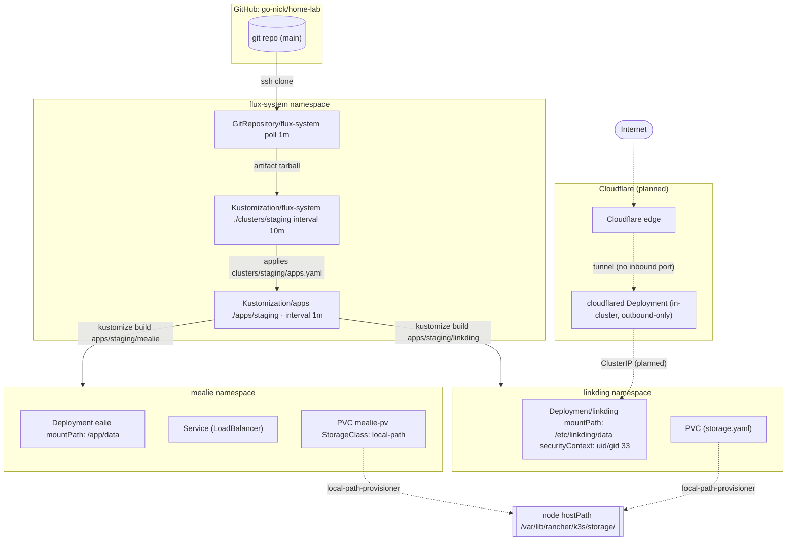

# home-lab

My HomeLab — k3s single-node cluster, GitOps via Flux.

## Architecture

**Reconcile chain:** `GitRepository` (fetch-only, no cluster writes) → root `Kustomization` (bootstraps Flux itself + applies everything under `clusters/staging`, including `apps.yaml`) → `apps` `Kustomization` (builds `apps/staging/*` overlays, applies to their namespaces).

**Planned:** Cloudflare Tunnel for `linkding` — `cloudflared` runs in-cluster, outbound-only connection to Cloudflare edge, no router port-forward needed. Same approach for `mealie` not yet decided.
